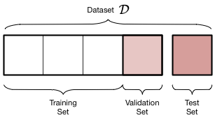

# Recognizing Persian Digits

## Introduction to problem
Given images of Persian Digits with their labels, predict what is the digit inside each image:


## Contents
* Libraries & Constants
* Machine Learning Categories
* Algorithm Selection
* Loading and Preprocessing 
* Model Impelemtation
* Training
* Model Evaluation
* Prediction

## Libraries & Constants


```python
from __future__ import print_function

import matplotlib.pyplot as plt
import numpy as np
import os
import sys
import tarfile
import random
import utils
from PIL import Image
import tensorflow as tf
from IPython.display import display
from scipy import ndimage
from sklearn.linear_model import LogisticRegression
from sklearn.model_selection import train_test_split
from six.moves.urllib.request import urlretrieve
from six.moves import cPickle as pickle
%matplotlib inline
```


```python
root = './data/Digits/isolated digits/'
prediction_root = './data/Digits/segmented digits/'
binary_save_path = './binary_data/isolated digits/'
model_save_path = './models/'
num_labels= 10
image_size = 28
batch_size = 64
epochs = 40
hidden_layer_neurons = 15
```

## Machine Learning Categories
* Supervised Learning
* Unsupervised Learning
* Semi-supervised Learning
* Reinforcement Learning

## Algorithm Selection
<ol>
    <li>Linear Regression</li>
    <li>Logistic Regression</li>
    <li>Decision Tree</li>
    <li>Neural Networks</li>
    <li>Naive Bayes</li>
    <li>SVM</li>
    <li>kNN</li>
    <li>Etc...</li>
</ol>

We choose neural networks because of:
* Number of features: 28*28=784
* Experiments showed that Neural Networks are good at classifying images


## Loading and Preprocessing Data
First we will load and normalize data, then we resize all of the images in (28,28) size and save it to binary .npy file:


```python
data_paths = utils.maybe_save(root,binary_save_path,image_size)
```

    ./binary_data/isolated digits/0.npy already present - Loading Data.
    ./binary_data/isolated digits/1.npy already present - Loading Data.
    ./binary_data/isolated digits/2.npy already present - Loading Data.
    ./binary_data/isolated digits/3.npy already present - Loading Data.
    ./binary_data/isolated digits/4.npy already present - Loading Data.
    ./binary_data/isolated digits/5.npy already present - Loading Data.
    ./binary_data/isolated digits/6.npy already present - Loading Data.
    ./binary_data/isolated digits/7.npy already present - Loading Data.
    ./binary_data/isolated digits/8.npy already present - Loading Data.
    ./binary_data/isolated digits/9.npy already present - Loading Data.
    

Checking if data is Balanced across diffrent classes : 


```python
def balancingCheck(data_folder) :
    dictionary = {}
    tmpList = None
    for i,ds in enumerate(data_folder) :
        dataset = np.load(ds)
        dictionary[i] = len(dataset)
    plt.bar(range(len(dictionary)), list(dictionary.values()), align='center')
    plt.xticks(range(len(dictionary)), list(dictionary.keys()))
    plt.show()
balancingCheck(data_paths)
```


As you see data is almost balanced over diffrent classes.

Merging and Creating Label for datasets :


```python
def merge_datasets(data_paths) :    
    data = np.concatenate([np.load(path) for path in data_paths],axis=0)
    label = np.concatenate([[path[-5]]*len(np.load(path)) for i,path in enumerate(data_paths)])
    return data,label
data,labels = merge_datasets(data_paths)
```

We should shuffle data:


```python
def randomize(dataset, labels):
    permutation = np.random.permutation(labels.shape[0])
    shuffled_dataset = dataset[permutation,:,:]
    shuffled_labels = labels[permutation]
    return shuffled_dataset, shuffled_labels
data,labels = randomize(data,labels)
```

We want to make sure that data still looks good:


```python
def visualize(dataset,labels,size = 10) :
    samples = np.random.randint(len(dataset),size=size)
    for i,sample in enumerate(samples) :
        plt.subplots_adjust(top=1.5)
        plt.subplot(np.ceil(np.sqrt(size)),np.floor(np.sqrt(size)),1+i)
        plt.axis('off')
        plt.title(labels[sample])
        plt.imshow(dataset[sample])
visualize(data,labels,10)
```


```python
def reformat(data,labels) :
    data = np.array(data).reshape((-1,image_size*image_size)).astype(np.float32)
    labels = (np.arange(num_labels) == labels[:,None].astype(np.float32))
    return data,labels
data,labels = reformat(data,labels)
print('shape of data : {}'.format(data.shape))
print('shape of labels : {}'.format(labels.shape))
```

    shape of data : (9653, 784)
    shape of labels : (9653, 10)
    




```python
def train_valid_test_spliter(data,labels) :
    X_train, X_test, y_train, y_test = train_test_split(data, labels, test_size=0.2, random_state=1)
    X_train, X_val, y_train, y_val = train_test_split(X_train, y_train, test_size=0.2, random_state=1)
    return X_train,y_train,X_val,y_val,X_test,y_test
X_train,y_train,X_val,y_val,X_test,y_test = train_valid_test_spliter(data,labels)
print('train data shape: {}'.format(X_train.shape))
print('train labels shape: {}'.format(X_train.shape))
print('valid data shape : {}'.format(X_val.shape))
print('valid labels shape: {}'.format(y_val.shape))
print('test data shape : {}'.format(X_test.shape))
print('test labels shape: {}'.format(y_test.shape))
```

    train data shape: (6177, 784)
    train labels shape: (6177, 784)
    valid data shape : (1545, 784)
    valid labels shape: (1545, 10)
    test data shape : (1931, 784)
    test labels shape: (1931, 10)
    

## Model Implementation


```python
model = tf.keras.Sequential()
model.add(tf.keras.layers.Dense(hidden_layer_neurons, activation='relu', input_shape=(image_size*image_size,)))
model.add(tf.keras.layers.Dense(num_labels, activation='softmax'))
model.compile(optimizer=tf.keras.optimizers.Adam(lr=1e-4), loss='categorical_crossentropy', metrics=['accuracy'])
```

## Training


```python
history = model.fit(X_train,y_train,batch_size=batch_size,epochs=epochs,validation_data=(X_val,y_val))
```

    Train on 6177 samples, validate on 1545 samples
    Epoch 1/40
    6177/6177 [==============================] - 7s 1ms/step - loss: 2.2648 - acc: 0.1402 - val_loss: 2.2140 - val_acc: 0.1955
    Epoch 2/40
    6177/6177 [==============================] - 1s 167us/step - loss: 2.1606 - acc: 0.2283 - val_loss: 2.0863 - val_acc: 0.2932
    Epoch 3/40
    6177/6177 [==============================] - 1s 122us/step - loss: 2.0305 - acc: 0.3307 - val_loss: 1.9682 - val_acc: 0.3547
    Epoch 4/40
    6177/6177 [==============================] - 1s 109us/step - loss: 1.9115 - acc: 0.3974 - val_loss: 1.8380 - val_acc: 0.4298
    Epoch 5/40
    6177/6177 [==============================] - 1s 112us/step - loss: 1.7662 - acc: 0.4900 - val_loss: 1.6797 - val_acc: 0.5314
    Epoch 6/40
    6177/6177 [==============================] - 1s 110us/step - loss: 1.6168 - acc: 0.5788 - val_loss: 1.5457 - val_acc: 0.6207
    Epoch 7/40
    6177/6177 [==============================] - 1s 113us/step - loss: 1.4917 - acc: 0.6387 - val_loss: 1.4332 - val_acc: 0.6667
    Epoch 8/40
    6177/6177 [==============================] - 1s 109us/step - loss: 1.3818 - acc: 0.6906 - val_loss: 1.3312 - val_acc: 0.6951
    Epoch 9/40
    6177/6177 [==============================] - 1s 114us/step - loss: 1.2853 - acc: 0.7224 - val_loss: 1.2413 - val_acc: 0.7424
    Epoch 10/40
    6177/6177 [==============================] - 1s 117us/step - loss: 1.2002 - acc: 0.7494 - val_loss: 1.1653 - val_acc: 0.7573
    Epoch 11/40
    6177/6177 [==============================] - 1s 113us/step - loss: 1.1255 - acc: 0.7627 - val_loss: 1.0944 - val_acc: 0.7683
    Epoch 12/40
    6177/6177 [==============================] - 1s 95us/step - loss: 1.0593 - acc: 0.7800 - val_loss: 1.0333 - val_acc: 0.7871
    Epoch 13/40
    6177/6177 [==============================] - 1s 106us/step - loss: 1.0005 - acc: 0.7929 - val_loss: 0.9759 - val_acc: 0.7981
    Epoch 14/40
    6177/6177 [==============================] - 1s 105us/step - loss: 0.9480 - acc: 0.7999 - val_loss: 0.9284 - val_acc: 0.8039
    Epoch 15/40
    6177/6177 [==============================] - 1s 111us/step - loss: 0.9021 - acc: 0.8091 - val_loss: 0.8831 - val_acc: 0.8175
    Epoch 16/40
    6177/6177 [==============================] - 1s 106us/step - loss: 0.8591 - acc: 0.8138 - val_loss: 0.8411 - val_acc: 0.8201
    Epoch 17/40
    6177/6177 [==============================] - 1s 105us/step - loss: 0.8137 - acc: 0.8242 - val_loss: 0.7978 - val_acc: 0.8304
    Epoch 18/40
    6177/6177 [==============================] - 1s 111us/step - loss: 0.7724 - acc: 0.8313 - val_loss: 0.7572 - val_acc: 0.8356
    Epoch 19/40
    6177/6177 [==============================] - 1s 109us/step - loss: 0.7351 - acc: 0.8409 - val_loss: 0.7264 - val_acc: 0.8427
    Epoch 20/40
    6177/6177 [==============================] - 1s 109us/step - loss: 0.7032 - acc: 0.8443 - val_loss: 0.6921 - val_acc: 0.8453
    Epoch 21/40
    6177/6177 [==============================] - 1s 104us/step - loss: 0.6742 - acc: 0.8493 - val_loss: 0.6664 - val_acc: 0.8531
    Epoch 22/40
    6177/6177 [==============================] - 1s 108us/step - loss: 0.6488 - acc: 0.8548 - val_loss: 0.6422 - val_acc: 0.8570
    Epoch 23/40
    6177/6177 [==============================] - 1s 106us/step - loss: 0.6251 - acc: 0.8577 - val_loss: 0.6199 - val_acc: 0.8531
    Epoch 24/40
    6177/6177 [==============================] - 1s 108us/step - loss: 0.6051 - acc: 0.8624 - val_loss: 0.6012 - val_acc: 0.8589
    Epoch 25/40
    6177/6177 [==============================] - 1s 108us/step - loss: 0.5857 - acc: 0.8676 - val_loss: 0.5832 - val_acc: 0.8654
    Epoch 26/40
    6177/6177 [==============================] - 1s 110us/step - loss: 0.5680 - acc: 0.8705 - val_loss: 0.5670 - val_acc: 0.8621
    Epoch 27/40
    6177/6177 [==============================] - 1s 117us/step - loss: 0.5520 - acc: 0.8721 - val_loss: 0.5519 - val_acc: 0.8680
    Epoch 28/40
    6177/6177 [==============================] - 1s 109us/step - loss: 0.5370 - acc: 0.8721 - val_loss: 0.5373 - val_acc: 0.8693
    Epoch 29/40
    6177/6177 [==============================] - 1s 107us/step - loss: 0.5229 - acc: 0.8786 - val_loss: 0.5247 - val_acc: 0.8699
    Epoch 30/40
    6177/6177 [==============================] - 1s 110us/step - loss: 0.5094 - acc: 0.8797 - val_loss: 0.5120 - val_acc: 0.8725
    Epoch 31/40
    6177/6177 [==============================] - 1s 106us/step - loss: 0.4980 - acc: 0.8808 - val_loss: 0.4993 - val_acc: 0.8777
    Epoch 32/40
    6177/6177 [==============================] - 1s 115us/step - loss: 0.4867 - acc: 0.8826 - val_loss: 0.4901 - val_acc: 0.8764
    Epoch 33/40
    6177/6177 [==============================] - 1s 113us/step - loss: 0.4759 - acc: 0.8860 - val_loss: 0.4798 - val_acc: 0.8803
    Epoch 34/40
    6177/6177 [==============================] - 1s 112us/step - loss: 0.4664 - acc: 0.8842 - val_loss: 0.4704 - val_acc: 0.8796
    Epoch 35/40
    6177/6177 [==============================] - 1s 110us/step - loss: 0.4572 - acc: 0.8876 - val_loss: 0.4646 - val_acc: 0.8796
    Epoch 36/40
    6177/6177 [==============================] - 1s 110us/step - loss: 0.4485 - acc: 0.8893 - val_loss: 0.4551 - val_acc: 0.8803
    Epoch 37/40
    6177/6177 [==============================] - 1s 118us/step - loss: 0.4400 - acc: 0.8886 - val_loss: 0.4475 - val_acc: 0.8854
    Epoch 38/40
    6177/6177 [==============================] - 1s 111us/step - loss: 0.4326 - acc: 0.8935 - val_loss: 0.4388 - val_acc: 0.8828
    Epoch 39/40
    6177/6177 [==============================] - 1s 112us/step - loss: 0.4253 - acc: 0.8932 - val_loss: 0.4316 - val_acc: 0.8828
    Epoch 40/40
    6177/6177 [==============================] - 1s 111us/step - loss: 0.4174 - acc: 0.8938 - val_loss: 0.4252 - val_acc: 0.8861
    

Visualizing the training and validation accuracy:


```python
plt.plot(history.epoch, history.history['val_acc'], c='r')
plt.plot(history.epoch, history.history['acc'], c='g')
plt.title('Training & Validation Accuracy')
plt.xlabel('Epoch Number')
plt.ylabel('Accuracy')
plt.legend(('Validation Accuracy', 'Training Accuracy'),
           loc='lower right')
```


    <matplotlib.legend.Legend at 0x2484a8fcf28>


## Model Evaluation


```python
scores = model.evaluate(X_test,y_test)
print('Test Accuracy: %{}'.format(scores[1]*100))
print("Test Error: %{}".format(100 - scores[1]*100))

```

    1931/1931 [==============================] - ETA:  - 1s 276us/step
    Test Accuracy: %88.60693940345887
    Test Error: %11.393060596541133
    

## Prediction


```python
def predict_image(prediction_root,image_size,model) :
    for i,path in enumerate(os.listdir(prediction_root)):
        plt.subplots_adjust(top=1.5)
        photoes_path = os.path.join(prediction_root,path)
        photoes = os.listdir(photoes_path)
        photo_path = np.random.choice(photoes)
        processed_image = (np.array(Image.open(os.path.join(photoes_path, photo_path)).resize((image_size,image_size))).astype(float) - 
                            255.0 / 2) / 255.0
        photo = np.array(Image.open(os.path.join(photoes_path,photo_path)).resize((image_size,image_size))).astype(np.float)
        plt.subplot(np.ceil(np.sqrt(10)),np.floor(np.sqrt(10)),1+i)
        plt.axis('off')
        plt.title(np.argmax(model.predict(processed_image.reshape(1,image_size*image_size))))
        plt.imshow(photo)
predict_image(prediction_root,image_size,model)
```


